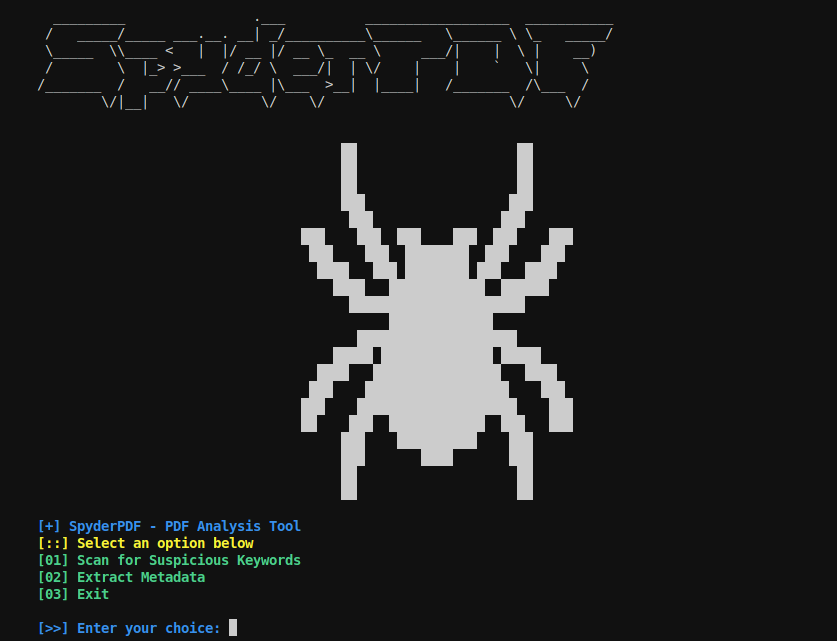

# 🕷️ SpyderPDF - PDF Analysis & Threat Detection Tool

**SpyderPDF** is a Python-based tool designed to scan and analyze PDF files for potential security threats. It detects suspicious keywords commonly used in malicious PDFs, extracts metadata for forensic investigation, and provides a terminal-friendly interface for easy use.



## What it Does

- Detects **suspicious keywords** (e.g. `/JavaScript`, `/Launch`, `/OpenAction`)
- Extracts **PDF metadata** such as title, author, creation date
- Displays a stylish **ASCII art banner** at launch
- Provides a clear **menu-driven CLI interface**
- Built for **educational and research** purposes

## Why It Matters

PDFs are commonly used in phishing campaigns and malware distribution. SpyderPDF helps users understand what's inside a PDF before opening it, improving awareness and digital hygiene.

## Features

- Keyword-based static scanning
- Metadata extraction using `PyPDF2`
- Easy-to-navigate terminal UI
- Beginner-friendly modular code
- Planned features: embedded file detection, YARA support, entropy analysis

### Prerequisites

- Python 3.7+
- Install required libraries:

```bash
pip install PyPDF2
```
### Run the Tool
```bash
python3 analyzer.py
```
# Choose between:
- Scanning for suspicious elements
- Extracting metadata
- Exiting the tool

### Educational Guide
# A supporting PDF guide has been written to help the public understand:
- Common PDF-based attack techniques
- SpyderPDF’s role in detection
- Security tips for handling suspicious documents

# Let me know if you want:
- A version with GitHub badges (like stars, forks, license)
- A Greek translation
